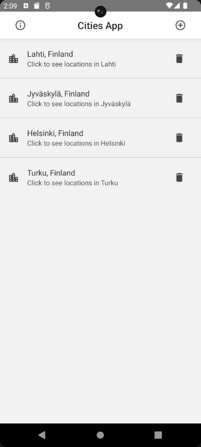
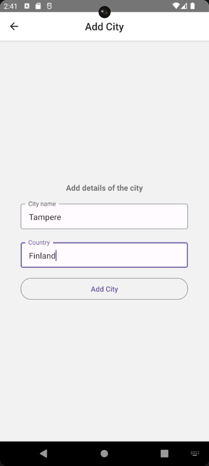
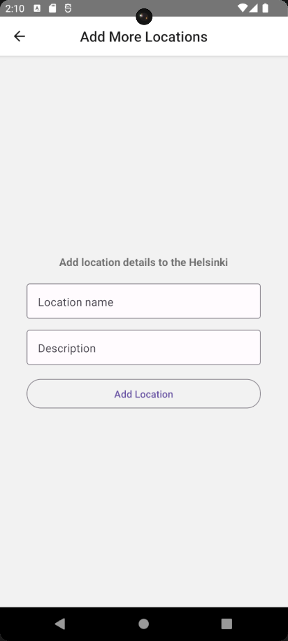
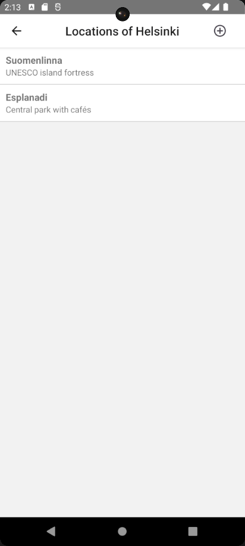

# CitiesApp

A cross-platform mobile app built with [React Native](https://reactnative.dev) for managing cities and locations. Supports Android and iOS.

## Features
- Add, view, and manage cities and locations
- Info and home screens
- State management via Context API and Redux Toolkit
- Native integration for Android (Kotlin) and iOS (Objective-C++)

## Demo Video
https://www.youtube.com/watch?v=maBmZd6BL9E

## Screenshots
<table>
   <tr>
      <td align="center">
         <br>Home Screen
      </td>
      <td align="center">
         <br>Add City Screen
      </td>
   </tr>
   <tr>
      <td align="center">
         <br>Locations Screen
      </td>
      <td align="center">
         <br>Locations List Screen
      </td>
   </tr>
</table>

## Quick Start
1. **Install dependencies:**
   ```bash
   git clone https://github.com/FerhatArslann/CitiesApp.git
   cd CitiesApp
   npm install
   # or
   yarn install
   ```
2. **Start Metro Bundler:**
   ```bash
   npm start
   # or
   yarn start
   ```
3. **Run on Android:**
   ```bash
   npm run android
   # or
   yarn android
   ```
   **Run on iOS:**
   ```bash
   npm run ios
   # or
   yarn ios
   ```

## Testing
- Run unit tests with:
  ```bash
  npm test
  # or
  yarn test
  ```

## Requirements
| Platform      | Minimum Version | Recommended Version         |
|--------------|-----------------|----------------------------|
| Android      | 6.0 (API 23)    | 13+ (API 33+), SDK 34+      |
| iOS          | 12.0            | 15+, Xcode 15+              |
| Node.js      | 16.x            | 18.x or newer               |
| React Native | 0.72.x          | Latest stable               |

## Troubleshooting
Refer to the [React Native Troubleshooting Guide](https://reactnative.dev/docs/troubleshooting) for common issues.

## Resources
- [React Native Documentation](https://reactnative.dev/docs/getting-started)
- [React Native GitHub](https://github.com/facebook/react-native)
